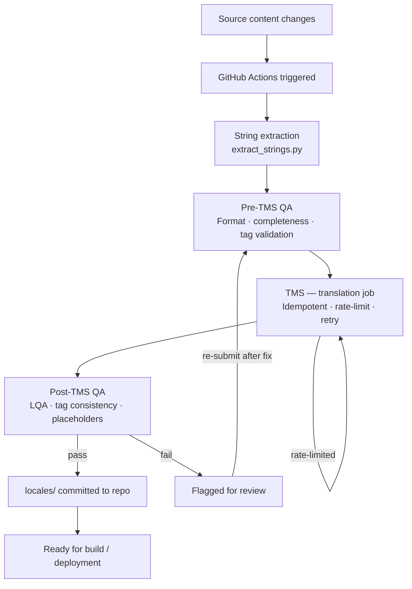

# L10N-Automation-Pipeline

> A stateless integration layer for automated translation workflows with idempotency and rate-limit handling.

---

## What problem does this solve?

In enterprise localization, the handoff between source content and translated output is almost always manual — a PM exports strings, uploads to a TMS, waits, downloads, runs QA, and commits. This is slow, error-prone, and doesn't scale when content changes frequently.

This pipeline automates that entire loop. When source content changes, GitHub Actions triggers string extraction, runs a pre-TMS quality check, submits the job to the TMS with idempotency guarantees, runs post-translation QA on the output, and commits clean locale files back to the repo — all without human intervention. Failures at any QA gate are flagged and loop back automatically rather than silently passing bad strings downstream.

---

## How it works


---

## Key design decisions

| Decision | Why |
|---|---|
| **Stateless** | No database or persistent state needed. Each run is self-contained — safe to re-trigger without side effects. |
| **Idempotent TMS calls** | Re-running the workflow on the same content produces the same result, not duplicate translation jobs. |
| **Pre-TMS QA gate** | Catches malformed or incomplete strings before they reach the TMS, avoiding wasted translation credits and rework. |
| **Post-TMS QA gate** | Validates translated output before it lands in the repo — broken placeholders or missing tags never reach build. |
| **Rate-limit handling** | Built-in retry with backoff — the pipeline doesn't fail on transient API throttling. |
| **CI/CD native** | Lives in `.github/workflows/` — plugs into any repo's existing pipeline with no extra infrastructure. |

---

## Folder structure
```
.github/workflows/    GitHub Actions workflow (localization trigger + QA steps)
scripts/              extract_strings.py — parses source, outputs translatable strings
src/                  Core pipeline logic (app.js) — TMS integration, idempotency, retry
locales/              Output directory — validated locale files committed here
```

---

## Getting started
```bash
# Clone the repo
git clone https://github.com/AmalJosephjk/L10N-automation-pipeline.git

# Install dependencies
npm install

# Run string extraction manually
python scripts/extract_strings.py

# Or let GitHub Actions handle it — push to main to trigger the full pipeline
```

> **Required environment variables:** add these as GitHub Actions secrets before running:
> - `TMS_API_KEY` — your TMS API credentials
> - `TARGET_LANGUAGES` — comma-separated locale codes (e.g. `fr,de,ja,zh-CN`)

---

## Built by

[Amal Joseph](https://linkedin.com/in/amaljosephjk) — Localization Project Manager with 7+ years of enterprise localization experience across 30+ languages. This pipeline was built to eliminate the manual handoff friction encountered managing large-scale programs with multiple vendors and TMS environments.

---

## Contributing

PRs welcome. If you want to extend this for a specific TMS (Trados, MemoQ, Phrase) or add support for additional file formats, open an issue first to align on scope.
